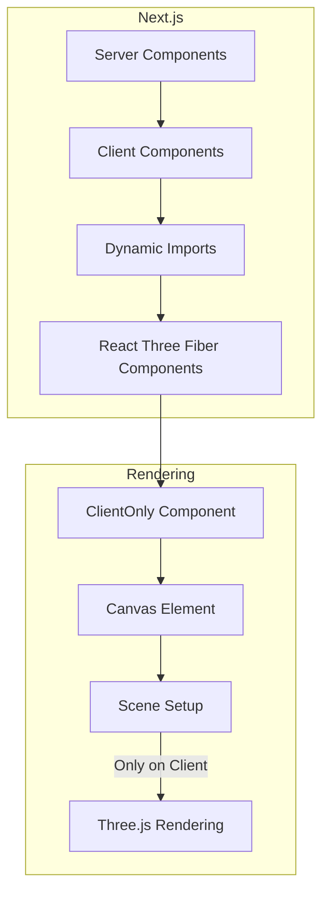

# System Patterns

## Architecture Overview
The project follows a modern Next.js 14 architecture with:
- App Router for routing and layouts
- Server and Client Components
- API Routes for backend functionality
- Supabase for data storage
- SendGrid for email handling
- Vercel for deployment and analytics
- Three.js and React Three Fiber for 3D rendering

## Design Patterns
1. Component Architecture:
   - Atomic design principles
   - Radix UI for base components
   - Custom hooks for reusable logic
   - Context providers for global state

2. Data Flow:
   - Server-side rendering where possible
   - Client-side interactivity where needed
   - API routes for backend operations
   - Form handling with React Hook Form

3. State Management:
   - React hooks for local state
   - Context API for global state
   - Server state with Next.js data fetching

## Component Relationships
1. Layout Structure:
   ```
   RootLayout
   ├── LayoutClient
   │   ├── Header
   │   ├── Main Content
   │   └── Footer
   └── Analytics
   ```

2. Feature Organization:
   - Pages grouped by feature (woodworking, contact, about)
   - Shared components in app/components
   - Utilities in app/utils
   - API routes in app/api

## Technical Decisions
1. Framework Choices:
   - Next.js 14 for SSR and routing
   - TypeScript for type safety
   - Tailwind CSS for styling
   - Radix UI for accessible components
   - Three.js and React Three Fiber for 3D visualizations

2. Performance Optimizations:
   - Image optimization with next/image
   - Font optimization
   - Code splitting
   - Cache strategies

3. Development Patterns:
   - ESLint for code quality
   - TypeScript for type checking
   - Component-driven development
   - Responsive design first

## Integration Points
1. External Services:
   - Supabase for data
   - SendGrid for email
   - Vercel Analytics
   - Three.js for 3D
   - Firecrawl API (Financial Assistant Chat via `/api/financial-assistant/firecrawl`)
   - Alpaca API (Market Data Ticker via `/api/market/data`)

2. Internal Systems:
   - Image processing pipeline
   - Form validation system
   - Admin authentication
   - API route handlers

## Demo Architecture
1. Core Demo Structure:
   ```
   demos/
   ├── [demo]/
   │   ├── page.tsx (Demo UI)
   │   ├── components/ (Demo-specific components)
   │   ├── hooks/ (Custom demo hooks)
   │   └── api/ (Demo backend endpoints)
   └── page.tsx (Demo gallery)
   ```

2. Demo Integration Patterns:
   - Lazy loading for performance
   - Isolated state management
   - Shared UI components
   - Error boundary protection
   - Analytics integration

3. Demo Data Flow:
   ```mermaid
   flowchart TD
     subgraph Financial Assistant Demo
       FA_UI[Financial Assistant UI]
       MarketTicker[Market Ticker UI]

       FA_UI -- Chat Query --> RateLimiter{Rate Limit Check (IP)}
       RateLimiter -- Allowed --> FA_Firecrawl_API[API Route: /api/financial-assistant/firecrawl]
       RateLimiter -- Denied --> FA_UI(429 Error)
       FA_Firecrawl_API -- Check Market Status --> MarketStatus[Market Status Check (Simulated/Alpaca)]
       MarketStatus -- Status --> FA_Firecrawl_API
       FA_Firecrawl_API -- Scrape Request --> Firecrawl[Firecrawl Scrape/Extract]
       Firecrawl -- Extracted Data --> FA_Firecrawl_API
       FA_Firecrawl_API -- Formatted Response (with Status) --> FA_UI

       MarketTicker -- Request Data --> FA_Alpaca_API[API Route: /api/market/data]
       FA_Alpaca_API -- Market Data Request --> Alpaca[Alpaca API]
       Alpaca -- Market Data --> FA_Alpaca_API
       FA_Alpaca_API -- Ticker Data --> MarketTicker
     end

     subgraph Other Demos
       UI[Demo UI] --> State[Local State]
       State --> API[API Layer]
       API --> External[External Services]
       External --> API
       API --> State
       State --> UI
     end
   ```

4. Common Demo Features:
   - Authentication handling
   - Error management
   - Loading states
   - Progress tracking
   - Result caching
   - Analytics events

5. Demo Security:
   - Rate limiting
   - Input validation
   - API key protection
   - User session management
   - Error sanitization

## Performance Patterns
1. Loading Strategies:
   - Route-based code splitting
   - Component lazy loading
   - Image lazy loading
   - Font optimization
   - Resource prioritization

2. Caching:
   - Static page caching
   - API response caching
   - Image caching
   - Font caching
   - State persistence

3. Optimization:
   - Bundle size analysis
   - Tree shaking
   - Dead code elimination
   - Resource minification
   - Compression

## Error Handling
1. Client-side:
   - React error boundaries
   - Form validation
   - Network error handling
   - State recovery
   - Retry mechanisms

2. Server-side:
   - API error handling
   - Database error management
   - Service unavailability
   - Rate limit handling
   - Validation errors

3. Monitoring:
   - Error tracking
   - Performance monitoring
   - User behavior analytics
   - API usage metrics
   - System health checks

## API Route Security
- **Authentication:** Admin routes protected (details TBD).
- **Input Validation:** Zod used for form validation, Next.js API routes validate inputs.
- **Rate Limiting:** IP-based rate limiting implemented using `@upstash/ratelimit` and Vercel KV on demo API endpoints (e.g., `/api/financial-assistant/firecrawl`). The `/api/financial-assistant/firecrawl` endpoint is limited to 3 requests per 60 seconds per IP. Limits for other demo APIs (e.g., `/api/market/data`) TBD.
- **Error Handling:** Sensitive error details are not exposed to the client; generic messages are returned while detailed errors are logged server-side.
- **API Key Management:** Keys (e.g., Firecrawl, SendGrid, Alpaca) are managed via environment variables (`.env.local`, Vercel environment settings).

## UI Patterns & Animations
- **Layout:** Primarily uses Tailwind CSS utility classes for layout (Flexbox, Grid).
- **Component Library:** Radix UI for accessible base components, styled with Tailwind.
- **Motion:** Framer Motion used for page transitions and hover/tap effects on interactive elements (buttons, cards).
- **Complex Animations:** GSAP with ScrollTrigger used for more intricate scroll-based animations, such as:
    - Demo page card animations: Initial staggered fade-in on load, followed by opacity changes based on scroll position (fading out near viewport edges, fully opaque in the center) using `scrub`. 
    - (Add other specific GSAP animations here as implemented)
- **Responsiveness:** Mobile-first approach using Tailwind's responsive modifiers. 

## Reinforcement Learning Chess AI Architecture

To move beyond the heuristic Chess AI, a Reinforcement Learning approach is being implemented. This involves two main components:

1.  **Offline Training Pipeline (`chess-rl-training-local`):**
    *   **Location:** Runs entirely locally on user's hardware (CPU + GPU).
    *   **Language/Framework:** Python, PyTorch.
    *   **Core Loop:** Iterative process inspired by AlphaZero:
        *   **Self-Play:** The current best neural network plays games against itself using MCTS (`src/mcts.py`) to guide move selection. This generates `(state, policy_target, value_target)` data.
        *   **Training:** The neural network (`src/neural_network.py`) is trained on batches of data collected from recent self-play games (`src/train.py`).
    *   **Board Representation:** Uses stacked 8x8 feature planes (`src/board_representation.py`).
    *   **Output:** Trained model checkpoints (`.pth`) and the final model exported to ONNX format (`model.onnx`).
    *   **Environment:** Managed via Conda (`chess_rl` environment).
    *   **Data Storage:** Self-play game data (`.npz`) and model files are stored locally within the `runs/` directory.

2.  **Online Inference API (`/api/chess-ai-rl/move`):**
    *   **Location:** Vercel Python serverless function.
    *   **Purpose:** Receives a board state (FEN string) from the frontend, uses the trained model to determine the best move, and returns it.
    *   **Model Loading:** Loads the pre-trained `.onnx` model file from Supabase Storage.
    *   **Inference Engine:** Uses `onnxruntime` for efficient inference.
    *   **Move Selection:** Employs MCTS (adapted from training code) guided by the ONNX model's policy and value outputs to determine the best move.
    *   **Dependencies:** `onnxruntime`, `python-chess`, `Flask` (or Vercel handler framework).

## System Architecture

### Financial Assistant RAG Implementation

The financial assistant uses a sophisticated hybrid architecture combining several information retrieval and generation approaches:


#### Components

1. **Vector Database (Supabase with pgvector)**
   - Stores financial knowledge as vector embeddings
   - Enables semantic search through vector similarity
   - Organized by categories (investment strategy, market trends, etc.)
   - Implements Row Level Security for proper access control

2. **Real-time Information API**
   - Custom `/api/financial-assistant/realtime` endpoint
   - Pattern detection for determining when up-to-date info is needed
   - Fallback mechanisms when external services are unavailable
   - Result formatting for integration with vector search results

3. **Scheduled Knowledge Updates**
   - Daily updates of market trends and economic indicators
   - Automatic pruning of outdated information (>7 days old)
   - Date-stamped content for freshness tracking
   - Categories aligned with common financial queries

4. **Response Generation**
   - OpenAI integration with carefully designed system prompts
   - Dynamic context combining market data, RAG results, and user preferences
   - Instructions to prioritize real-time information when available
   - Disclaimers and source attribution

#### State Management

The financial assistant maintains several types of state:

1. **Session State**
   - Chat history for context
   - User preferences (investment style, risk tolerance, etc.)
   - Current market status

2. **Vector Database State**
   - Persistent financial knowledge base
   - Regularly updated with fresh information
   - Pruned of outdated content

3. **External Data State**
   - Real-time market data from Yahoo Finance
   - Web search results for current information
   - Regularly refreshed scheduled knowledge

#### Data Flow

1. User query is analyzed for intent detection
2. If general advice intent is detected, system checks if real-time info is needed
3. If needed, real-time API is called to fetch latest information
4. Vector database is queried for relevant knowledge
5. Market data, RAG results, and user preferences are combined
6. OpenAI generates comprehensive response with attribution
7. Response is sent back to user with appropriate formatting

## Chess Game 3D Visualization Architecture

The 3D chess board implementation uses React Three Fiber (R3F) and @react-three/drei to create an interactive 3D visualization that works alongside the existing 2D board:


### Core Components

1. **Canvas Container**: The R3F Canvas component creates the WebGL context and manages the Three.js scene.

2. **Scene Setup**:
   - `OrbitControls` for camera manipulation
   - `AmbientLight` for global illumination
   - `DirectionalLight` for shadows and directional lighting
   - `PerspectiveCamera` positioned to view the board at a 45° angle

3. **Chess Board**: 
   - Grid of alternating colored squares
   - Material with wood-like textures
   - Shadow receiving plane

4. **Chess Pieces**:
   - Currently using basic geometric shapes (cylinders, cones, spheres)
   - Material with different colors for black and white pieces
   - Positioned based on the game state
   - Cast shadows for depth perception

5. **State Management**:
   - One-way data flow from 2D board to 3D visualization
   - Game state shared between both views
   - Move validation and game logic handled by 2D board component
   - 3D board functions primarily as a spectator view

### Implementation Details

1. **Piece Representation**:
   ```typescript
   interface ChessPiece3D {
     type: 'p' | 'r' | 'n' | 'b' | 'q' | 'k';
     color: 'w' | 'b';
     position: { row: number; col: number };
     mesh: React.MutableRefObject<THREE.Group | null>;
   }
   ```

2. **Camera Position**:
   ```typescript
   const cameraPosition = [3, 4, 5] as [number, number, number];
   const cameraTarget = [3.5, 0, 3.5] as [number, number, number];
   ```

3. **Board Coordinates**:
   - Chess board centered at origin (0,0,0)
   - Each square is 1x1 unit
   - Board spans from 0,0,0 to 8,0,8
   - y-axis used for height

4. **Lighting Setup**:
   ```jsx
   <ambientLight intensity={0.4} />
   <directionalLight 
     position={[10, 10, 5]} 
     intensity={0.7} 
     castShadow 
     shadow-mapSize={[2048, 2048]} 
   />
   ```

5. **View Toggle**:
   ```jsx
   <div className="flex space-x-2 mb-4">
     <button 
       onClick={() => setView('2d')} 
       className={`px-3 py-1 ${view === '2d' ? 'bg-blue-600 text-white' : 'bg-gray-200'}`}
     >
       2D
     </button>
     <button 
       onClick={() => setView('3d')} 
       className={`px-3 py-1 ${view === '3d' ? 'bg-blue-600 text-white' : 'bg-gray-200'}`}
     >
       3D
     </button>
   </div>
   ```

### Planned Enhancements

1. **Detailed Models**: Replace geometric shapes with detailed 3D models for each piece type

2. **Animations**: Add smooth transitions for:
   - Piece movement
   - Captures
   - Special moves (castling, en passant)
   - Game state changes (check, checkmate)

3. **Interaction**: Enable direct piece selection and movement in 3D view

4. **Visual Effects**:
   - Improved materials and textures
   - Particle effects for captures
   - Highlighting for selected pieces and legal moves
   - Visual indication for check and checkmate

5. **Performance Optimization**:
   - Level of detail (LOD) for piece models
   - Reduced polygon count for mobile devices
   - Optimized lighting and shadow calculations

## React Three Fiber Integration Patterns

To properly integrate React Three Fiber (R3F) with Next.js and avoid server-side rendering (SSR) issues, a specific pattern is used throughout the application:



### React Three Fiber SSR Solution

1. **Dynamic Imports with SSR Disabled**:
   ```typescript
   // Import the Three.js components dynamically with SSR disabled
   const Canvas3D = dynamic(() => import('@react-three/fiber').then(mod => mod.Canvas), { ssr: false });
   const ThreeDScene = dynamic(() => import('./components/ThreeDScene'), { ssr: false });
   ```

2. **Component Separation Pattern**:
   - Page components are server components by default
   - 3D visualization logic is isolated in separate client components
   - `"use client"` directive marks components that contain React Three Fiber code
   - Main page imports the 3D components dynamically to avoid SSR issues

3. **ClientOnly Wrapper Component**:
   ```typescript
   // ClientOnly component (app/components/ClientOnly.tsx)
   'use client'
   
   import { useEffect, useState, ReactNode } from 'react'
   
   interface ClientOnlyProps {
     children: ReactNode
   }
   
   export default function ClientOnly({ children }: ClientOnlyProps) {
     const [mounted, setMounted] = useState(false)
     
     useEffect(() => {
       setMounted(true)
     }, [])
     
     if (!mounted) {
       return null // or a loading placeholder
     }
     
     return <>{children}</>
   }
   ```

4. **Using the ClientOnly Wrapper**:
   ```jsx
   <div className="fixed inset-0 w-screen h-screen pointer-events-none z-0">
     <ClientOnly>
       <Canvas3D>
         <FinancialSceneWrapper />
       </Canvas3D>
     </ClientOnly>
   </div>
   ```

5. **Isolated Three.js Dependencies**:
   - Three.js imports and dependencies are kept in dedicated files
   - Dependencies are never imported directly in page components
   - Main UI state is managed separately from 3D rendering logic

### Next.js Configuration for 3D Rendering

To optimize Next.js for 3D rendering with React Three Fiber:

1. **Webpack Configuration**:
   ```javascript
   // next.config.mjs
   const nextConfig = {
     // ...other config
     experimental: {
       webpackBuildWorker: true,
       optimizePackageImports: ['lucide-react']
     }
   }
   ```

2. **Module Optimization**:
   - Adjusted Webpack configuration to properly handle large 3D libraries
   - Proper code splitting for 3D components to reduce initial bundle size
   - Ensured tree-shaking for Three.js to remove unused code

3. **Error Handling**:
   - Error boundaries wrap 3D components to prevent whole-page crashes
   - Fallback UI shown when 3D rendering fails
   - Diagnostic logging for 3D rendering issues

### Implementation Examples

1. **Financial Assistant 3D Background**:
   ```jsx
   // In page.tsx
   "use client";
   
   // Dynamic import with SSR disabled
   const Canvas3D = dynamic(() => import('@react-three/fiber').then(mod => mod.Canvas), { ssr: false });
   const FinancialSceneWrapper = dynamic(() => import('./components/FinancialScene'), { ssr: false });
   
   export default function FinancialAssistantPage() {
     return (
       <div className="relative">
         {/* 3D Scene Canvas */}
         <div className="fixed inset-0 w-screen h-screen pointer-events-none z-0">
           <ClientOnly>
             <Canvas3D>
               <FinancialSceneWrapper />
             </Canvas3D>
           </ClientOnly>
         </div>
         
         {/* Rest of the UI */}
         <div className="relative z-10">
           {/* UI content here */}
         </div>
       </div>
     );
   }
   ```

2. **Chess 3D Visualization**:
   ```jsx
   // In page.tsx
   "use client";
   
   import dynamic from 'next/dynamic';
   import ChessGame from "@/app/chess/components/ChessGame";
   
   // Dynamic import with SSR disabled
   const Chess3D = dynamic(() => import('@/app/chess/components/Chess3D'), { ssr: false });
   
   export default function ChessAIDemo() {
     const [is3DMode, setIs3DMode] = useState(false);
     
     return (
       <div className="relative">
         {/* View toggle */}
         <div className="mb-4">
           <button onClick={() => setIs3DMode(false)}>2D View</button>
           <button onClick={() => setIs3DMode(true)}>3D View</button>
         </div>
         
         {/* Conditional rendering */}
         {is3DMode ? (
           // Only load the 3D component when in 3D mode
           <Chess3D />
         ) : (
           <ChessGame />
         )}
       </div>
     );
   }
   ```

### Key Benefits

1. **Performance**:
   - Reduced initial page load times by avoiding SSR of complex 3D scenes
   - Smaller JavaScript bundle sizes through dynamic imports
   - Better code splitting and tree shaking

2. **Reliability**:
   - Eliminated "Cannot read properties of undefined (reading 'ReactCurrentOwner')" errors
   - Prevented React context-related errors in SSR environments
   - More stable application across different rendering environments (dev, production)

3. **Development Experience**:
   - Clear separation between server and client components
   - Easier debugging of 3D rendering issues
   - More predictable component behavior

## Component Architecture

1. **Page Components**
   - Located in `/app/[route]/page.tsx`
   - Use server components by default for performance
   - Use client components for interactive elements
   - Structure follows Next.js 13+ App Router conventions
   - Pages delegate to specialized components for different sections

2. **UI Components**
   - Located in `/components/ui` for shared elements
   - Located in `/app/components` for page-specific elements
   - Follow Atomic Design principles (atoms, molecules, organisms)
   - Use TypeScript interfaces for props
   - Implement responsive design through Tailwind classes
   - Use composition over inheritance

3. **3D Visualization Components**
   - Always use dynamic imports with `{ ssr: false }` to prevent SSR issues
   - Main 3D components in dedicated files with proper Three.js imports
   - Use absolute imports for Three.js components to improve module resolution
   - Proper type definitions for Three.js elements (Group, Vector3, etc.)
   - Separate Three.js scene setup from React component logic
   - Use useFrame hook for animations instead of componentDidUpdate
   - Include proper error boundaries around 3D components
   - Always import Three.js namespaces with `import * as THREE from 'three'`
   - Import specific Three.js types with `import { Group } from 'three'`

4. **Layout Components**
   - Located in `/app/[route]/layout.tsx`
   - Provide consistent structure across pages
   - Handle metadata and viewport settings
   - Implement responsive container sizing
   - Manage theme context

5. **Context Providers**
   - Located in `/app/contexts/[name]Context.tsx`
   - Manage global state and theme
   - Implement user preferences
   - Handle authentication state
   - Provide consistent API for state management

6. **Hooks**
   - Located in `/hooks/use[Name].ts`
   - Follow React Hooks naming convention
   - Abstract common functionality
   - Handle side effects consistently
   - Implement proper cleanup
   - Use TypeScript for return types

7. **Utility Functions**
   - Located in `/lib` or `/utils`
   - Pure functions without side effects
   - Well-typed with TypeScript
   - Unit tested
   - Named exports for tree-shaking

8. **API Routes**
   - Located in `/app/api/[route]/route.ts`
   - Use Next.js 13+ Route Handlers
   - Implement proper request validation
   - Structure responses consistently
   - Handle errors gracefully
   - Support streaming where appropriate

## Responsive Design Patterns

1. **Mobile-First Approach**
   - Base styles for mobile devices
   - Media queries for larger screens
   - Use Tailwind's responsive prefixes (sm:, md:, lg:, xl:)
   - Test across multiple device sizes

2. **Fluid Typography**
   - Scale text based on viewport width
   - Min and max sizes to prevent extremes
   - Maintain proper text hierarchy at all sizes
   - Ensure readability on all devices

3. **Grid and Flex Layouts**
   - CSS Grid for two-dimensional layouts
   - Flexbox for one-dimensional layouts
   - Auto-fill and auto-fit for responsive grids
   - Gap properties for consistent spacing

4. **Component-Based Media Queries**
   - Inline responsive design with Tailwind
   - Component-specific breakpoints when needed
   - Use clamp() for fluid sizing

5. **Responsive Images**
   - Next.js Image component for optimization
   - Srcset for different resolutions
   - Art direction with picture element
   - Lazy loading for off-screen images

6. **Container Queries**
   - Component sizing based on parent container
   - Used for reusable components in different contexts
   - Implemented with CSS container queries or JS resize observers

7. **3D Content Responsiveness**
   - Scale 3D scenes based on container size, not viewport
   - Adjust camera properties based on screen dimensions
   - Reduce complexity of 3D scenes on mobile devices
   - Provide fallback 2D views for low-end devices
   - Use device capabilities detection for optimal performance
   - Implement responsive canvas sizing with useThree hook

8. **Accessibility Considerations**
   - Touch targets at least 44×44px on mobile
   - Focus states visible and enhanced
   - Proper contrast ratios maintained at all sizes
   - Keyboard navigation support
   - Screen reader compatibility